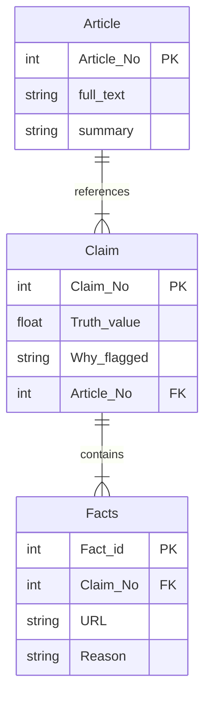

# og-extension

## ERD for Database

```mermaid
erDiagram
    Claim {
        int Claim_No PK
        float Truth_value
        string Why_flagged
        int Article_No FK
    }

    Facts {
        int Fact_id PK
        int Claim_No FK
        string URL
        string Reason
    }

    Article {
        int Article_No PK
        string full_text
        string summary
    }

    %% Relationships
    Claim ||--|{ Facts : "contains"
    Article ||--|{ Claim : "references"
```